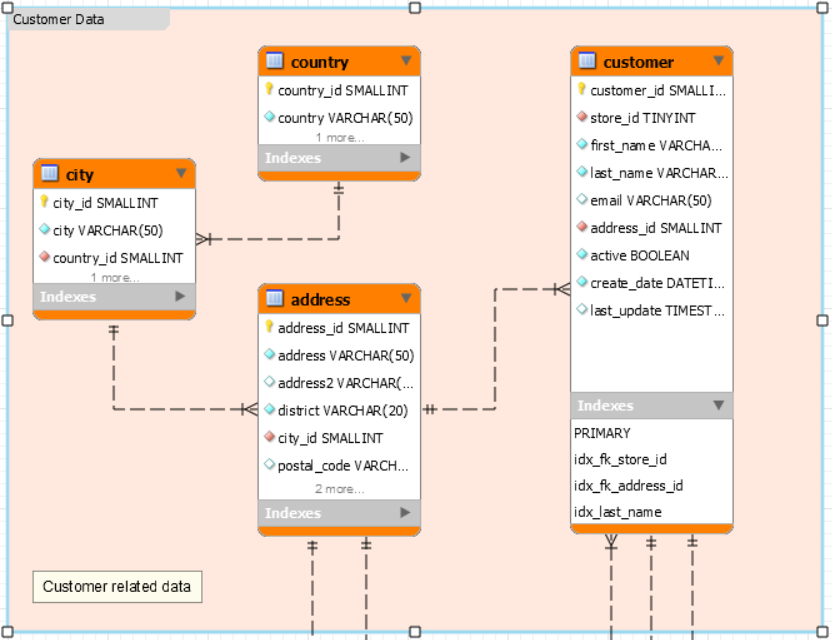

# Requêtes base de données Sakila

## Cours du 8 février 2018

1. Sélectionner les `customer` (first_name, last_name, create_date et last_update) avec les dates au format français (jj/mm/yyyy).

 - **select first_name, last_name, date_format(create_date,'%d/%m/%Y')
as create_date,date_format(last_update, '%d/%m/%Y') as last_update from customer;**

2. Sélectionner les `customer` (first_name, last_name et active); la propriété active doit être sous le format OUI/NON (OUI=1 et NON=0).

  - **select first_name, last_name, active, case active when 1 then 'oui' when
0 then 'non' end as valeur from customer;**

 - **select first_name, last_name, active, case when active='1' then 'oui' when
active='0' then 'non' end as valeur from customer;**

 - **select first_name, last_name, active,
case when active='1' then 'oui'
else 'non' end as valeur from customer;**

3. Sélectionner les 10 premiers et les 10 derniers enregistrements de la table `country` (ne pas utiliser la clause where).

 - **(select * from country limit 10)
union all
( select * from country order by country_id desc limit 10);**

4. Sélectionner tous `country`et leurs `city`(country et city); 1 ligne = 1 `country` et ses `city` séparées par une virgule.

 - **select country, group_concat(ci.city separator ', ') as city from country as co
join city as ci on ci.country_id = co.country_id
group by country;**
 - **select country, (select GROUP_CONCAT(ci.city separator ', ') from city as ci where ci.country_id=co.country_id) as city from country as co;**

5. Sélectionner les `country`(country) où les `customer` ne sont pas actifs, éviter les doublons.

 - **select distinct country
from country join city on (country.country_id = city.country_id)
join address on (address.city_id = city.city_id)
join customer on (customer.address_id = address.address_id)
where active = 0;**

