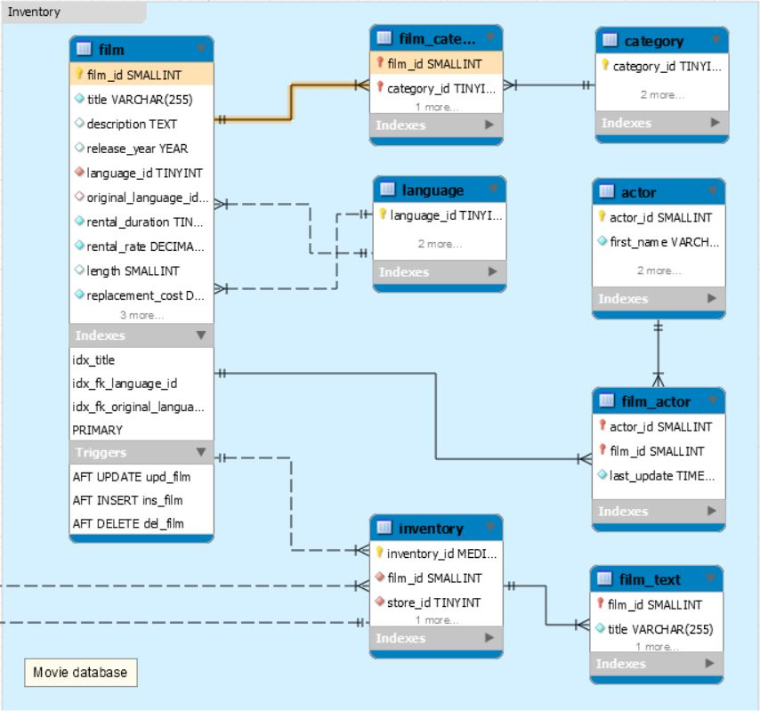

# Requêtes base de données Sakila

## Cours du 22 février 2018

1. Sélectionner le nom des `films` et leur `catégorie`, n'afficher que les films qui finissent pas la lettre `S`

2. Sélectionner la liste des `catégories` et le nombre de `films` associés à chaque `catégorie`.

3. Sélectionner les `acteurs` (nom et prénom), les `films` dans lesquels ils ont joués et la langue de chaque `film`.

4.Sélectionner les `films` : titre, temps de location (rental_duration) et durée du film (length). Le temps de location doit être sous le format XX mois et la durée du film doit être sous le format (hh:mm:ss).

5. Sélectionner le dernier `film` ajouté à chaque `catégorie` (nom de la catégorie, id du film et le titre du film).

