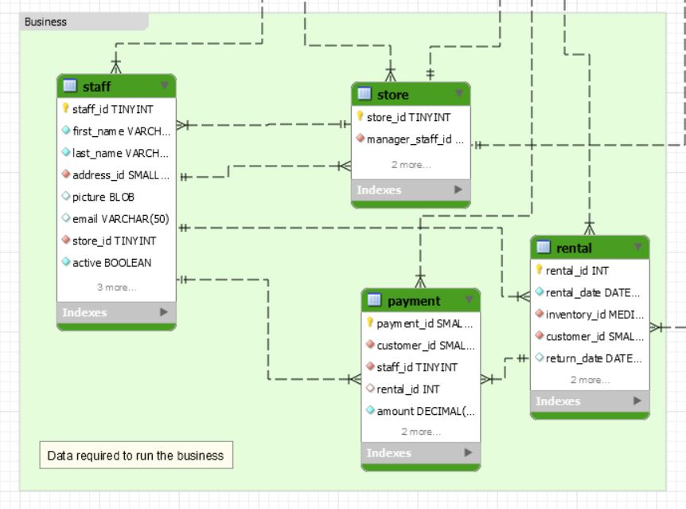

# Requêtes base de données Sakila

## Cours du 01 mars 2018

1. Sélectionner les id des locations(`rental`) et la durée en nombre de jours de chaque location de film (rental_date, return_date)

2. Sélectionner le nom des films (`film`) et le nombre de location (`rental`) faites pour chaque film (film => inventory => rental)

3. Sélectionner tous les paiements (`payment`) et leurs locations (`rental`) même si elles n'existent (amout, rental_id).

4. Sélectionner nom, prénom et la somme des `paiements` (payment) des `utilisateurs` (customer). Filter seulement les utilisateurs ayant une somme supérieure à 135.

5. Sélectionner le plus petit paiement et le plus grand paiement (`payment`).

